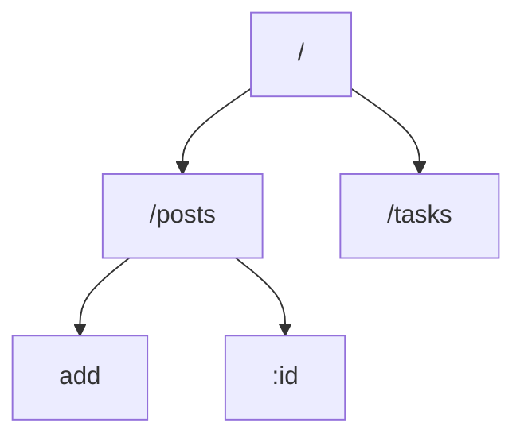

# IEEE React Session

- ****ES7+ React/Redux/React-Native snippets****
- ** ****Tailwind CSS IntelliSense****
- ****React PropTypes Generate****
- ****Prettier - Code formatter****

# Outline

1. **Tools**
    1. **npm ⇒** 🕹️ how to play with it?
    2. **vite ⇒** replace **`npx create-react app`**
    3. **json-server** **⇒** 😜 don’t need Backend just fake it
    4. ** **tailwind** **⇒** just classnames 👀
2. 🌴 **React Router ⇒** where’s my pages??? 😱 
3. 🤖 **More Hooks**
    1. 🏎️ **Hooks** for more **optimizations** 
        1. **`Memo`             ⇒ remember components**
        2. **`useMemo`        ⇒ remember values**
        3. **`useCallback` ⇒ remember functions**
    2. 🤔 **Hooks** for more **control** on your **state**
        1. **`useState`**     **⇒** 😎 **comfort zone**
        2.  **`useReducer`** **⇒** 😵‍💫 **Complex than ever**
        3. **`useContext`  ⇒** 👶 **The grandchildrens should know.**
4. **🥸 More Advance Topics**
    1. **`Ref`  ⇒ for DOM in react**
    2. ****Custom hooks ⇒**** should make things easy !! should ********😨
    3. ****Hocs (high order components) ⇒ w****rap up the component 🫔
5. ****Formik | YUP ⇒**** handel forms like pro 👨‍🏫
6. ****Type Checking ⇒**** Who I am ?? 🙃

# Tools

## **npm ⇒** 🕹️ how to play with it?

- **Package.json**
    - Why?
    - scripts
    - dependencies
    - devDependencies

| command | what it do |
| --- | --- |
| npm init | initalize package.json |
| npm i | alias for npm install ⇒ install all libraries in package.json |
| npm i lib_name | install library lib_name package.json |
| npm i -g lib_name | install library lib_name globally |
| npm i -d lib_name | install library lib_name devDependencies |
| npm un lib_name | uninstall library in package.json | can add -g |
| npm run script_name | run the command in scripts |

## Vi**te**

- first let’s take look at the past ⌛
    
    
    
    
    
    
- What it Do Exactly?
    - run your code **locally**
    - **bundle** your files in single file **for production**
    - more simple | fast  + less errors
- How To use it?
    1. `npm i -g vite`
    2. `npm create vite@latest`
    3. `npm run dev`

## **json-server**

- `npm install -g json-server`
- create **dp.json** with
    
    ```json
    {
    	"posts": [
    		{"id": 1,"heading": "hello world in js", "body": "console.log('hello')"}
    	],
    	"tasks": [
    		{"body": "finish IEEE session", "isCompleted": false, "id": 1},
    		{"body": "Do A React project", "isCompleted": false, "id": 2}
    	]
    }
    ```
    
- `json-server --watch db.json`

| Method  | Routes |
| --- | --- |
| GET | POST | http://localhost:3000/posts |
| GET | PUT | PATCH | DELETE | http://localhost:3000/posts/1 |
| GET | http://localhost:3000/tasks?body=finish%20IEEE%20session |
| GET | http://localhost:3000/tasks?_page=1&_limit=2 |
| etc…. | there other functions [search, slice, sort, greater than…] ⇒ https://www.npmjs.com/package/json-server |

## ** **tailwind** **⇒** just classnames 👀

- **installation**
    1. `npm install -D tailwindcss postcss autoprefixer`
    2. `npx tailwindcss init -p`
    3. in **tailwind.config.cjs** 
        
        ```
        /** @type {import('tailwindcss').Config} */
        module.exports = {
          content: [
            "./index.html",
        
            "./src/**/*.{js,ts,jsx,tsx}",
          ],
          theme: {
            extend: {},
          },
          plugins: [],
        }
        ```
        
    4. in **index.css** add this lines
        
        ```css
        @tailwind base;
        @tailwind components;
        @tailwind utilities;
        ```
        
- ****Tailwind CSS IntelliSense =⇒ vscode extension****
- cheat sheet ⇒ [https://tailwindcomponents.com/cheatsheet/](https://tailwindcomponents.com/cheatsheet/)

_____________________________________________________________________________________________________________________________________

### Take A Look To the Session Output


**Routes**



_____________________________________________________________________________________________________________________________________

# 🌴 **React Router ⇒** where’s my pages??? 😱

- so how do i make multiple pages in React even it’s **SAP**
- installation
    - `npm install react-router-dom localforage match-sorter sort-by`
    
    ```jsx
    import {createBrowserRouter, RouterProvider,} from "react-router-dom";
    const router = createBrowserRouter([
      {
        path: "/",
        element: <div>Hello world!</div>,
      },
    ]);
    ReactDOM.createRoot(document.getElementById("root")).render(
      <React.StrictMode>
        <RouterProvider router={router} />
      </React.StrictMode>
    );
    ```
    
- error page
    - ErrorPage (component)
        
        `import { useRouteError } from "react-router-dom";`
        
        `const error = useRouteError();`
        
        `error.statusText || error.message`
        
    - in router
        
        `errorElement: <ErrorPage />,`
        
- childreen
    - inside router
        
        
        ```
          {
            path: "/",
            element: <Root />,
            errorElement: <ErrorPage />
          },
          {
            path: "/posts",
            element: <Posts />
          }
        ```
        
        ```
        {
            path: "/",
            element: <Root />,
            errorElement: <ErrorPage />,
            children: [
              {
                path: "/posts",
                element: <Posts />
              }
            ]
        },
        ```
        
    - Outlet [in parent component]
        - `**import { Outlet } from "react-router-dom";**`
        - `**<Outlet />**`
- client side Routing **[Link, NavLink]**
    
    
    ```jsx
    <a href='/posts'>posts</a>
    ```
    
    ```jsx
    <NavLink to='/posts'>posts</NavLink>
    ```
    
    ```jsx
    <Link to='/posts'>posts</Link>
    ```
    
- **useParams()**
    - `**path: "/posts/:id",**`
    - `import { useParams } from 'react-router-dom’`
    - `const { id } = useParams();`
- [React router official tutorial](https://reactrouter.com/en/main/start/tutorial)

# 🤖 **More Hooks**

## 🏎️ **Hooks** for more **optimizations**

1. **`Memo`             ⇒ remember components ⇒** [reference](https://www.robinwieruch.de/react-memo/)
2. **`useMemo`        ⇒ remember values** ⇒ [reference](https://www.robinwieruch.de/react-usememo-hook/)
3. **`useCallback` ⇒ remember functions** ⇒ [reference](https://www.robinwieruch.de/react-usecallback-hook/)

## 🤔 **Hooks** for more **control** on your **state**

- **`useState`**     **⇒** 😎 **comfort zone**
- **`useReducer`** **⇒** 😵‍💫 **Complex than ever**
    - Terms [Reference 1](https://www.youtube.com/watch?v=w9ghRG9Foiw&t=304s) + [Reference 2](https://www.robinwieruch.de/react-usereducer-hook/)
        
        
        
        - Life Example
            - you will order from cashier
            - cashier
                1. **make new order with order details**
                2. **send order to kitchen system**
            - kitchen system **add** the new oder to current orders list
            - when kitchen finish order ⇒ [the manager + cashier + you] should know
        - Keywords
            - **store** ⇒ المطعم ||||||||||||||| web form
            - **action** have two things
                - type ⇒ the new order
                - payload ⇒ order details
            - then the **action dispatch**  in the kitchen and recived by some people called **(reducers)**
            - **reducers change state**(الليستة) ****of kitchen
    
    
    
- **`useContext`  ⇒** 👶 **The grandchildrens should know.**
    
    `const CNTXT = createContext()`
    
    `CNTXT.Provider value=””`
    
    `const d = useContext()`
    

# **🥸 More Topics**

## **`Ref`  ⇒ for DOM in react**

## ****Custom hooks ⇒**** should make things easy !! should ********😨

## ****Hocs (high order components) ⇒ w****rap up the component 🫔

# **Formik | YUP ⇒**  handel forms like pro 👨‍🏫

`npm install formik`

`npm install yup`

```jsx
import * as Yup from "yup";
export const signupInitialValues = {
  username: "",
  firstName: "",
  lastName: "",
  email: "",
  password: "",
  confirmPassword: "",
};

export const LoginSchema = Yup.object().shape({
  /* email validation */
  email: Yup.string().email("please enter a valid email").required("required"),

  /* password validation */
  password: Yup.string()
    .min(8, "at least 8 characters")
    .max(128, "at most 128 characters")
    .minLowercase(1, "at lease 1 lower case letter")
    .minUppercase(1, "at lease 1 upper case letter")
    .minNumbers(1, "at least 1 number")
    .minSymbols(1, "at lease 1 symbol")
    .required("required"),
});

export const SignupSchema = LoginSchema.shape({
  /* first name */
  firstName: Yup.string()
    .min(3, "at least 3 characters")
    .max(32, "at most 32 characters")
    .matches(/^[aA-zZ\s]+$/, "Only alphabets are allowed for this field ")
    .required("required"),

  lastName: Yup.string()
    .min(3, "at least 3 characters")
    .max(32, "at most 32 characters")
    .matches(/^[aA-zZ\s]+$/, "Only alphabets are allowed for this field ")
    .required("required"),

  username: Yup.string()
    .min(3, "at least 3 characters")
    .max(32, "at most 32 characters")
    .required("required"),
  confirmPassword: Yup.string().oneOf(
    [Yup.ref("password"), null],
    "Passwords must match"
  ),
});

/////////////////////////
<Formik
            initialValues={addArticleInitialValues(id)}
            validationSchema={AddArticleSchema}
            onSubmit={onSubmit}
        >
 <Form encType='multipart/form-data' className='form'>
```

# ****Type Checking ⇒**** Who I am ?? 🙃

`npm install prop-types --save`

`import PropTypes from 'prop-types';`

```jsx
const Count = (props) => {
};

Count.propTypes = {
  //// key is the name of the prop and
// value is the PropType
}
```


